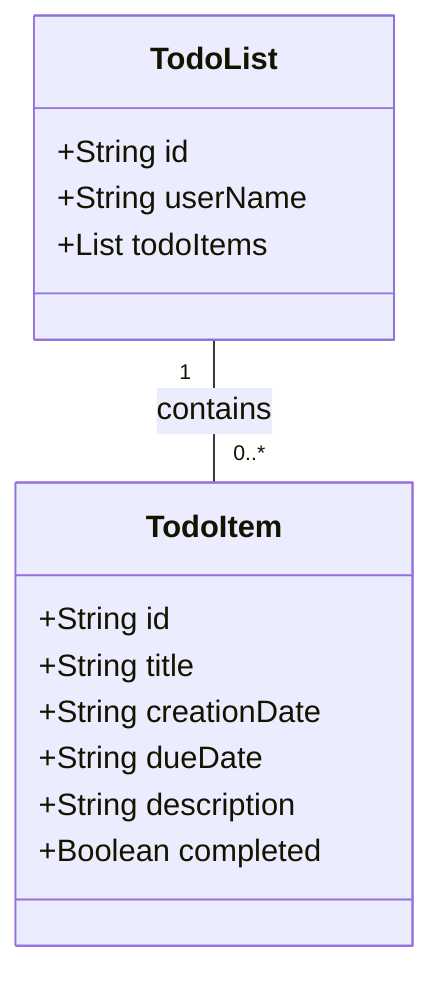

# My first TODO LIST using Spring Boot 

Project created for completing the DIO course.

```mermaid

classDiagram
    class TodoList {
        +String id
        +String userName
        +List<TodoItem> todoItems
    }

    class TodoItem {
        +String id
        +String title
        +String creationDate
        +String dueDate
        +String description
        +Boolean completed
    }

    TodoList "1" -- "0..*" TodoItem : contains
```
